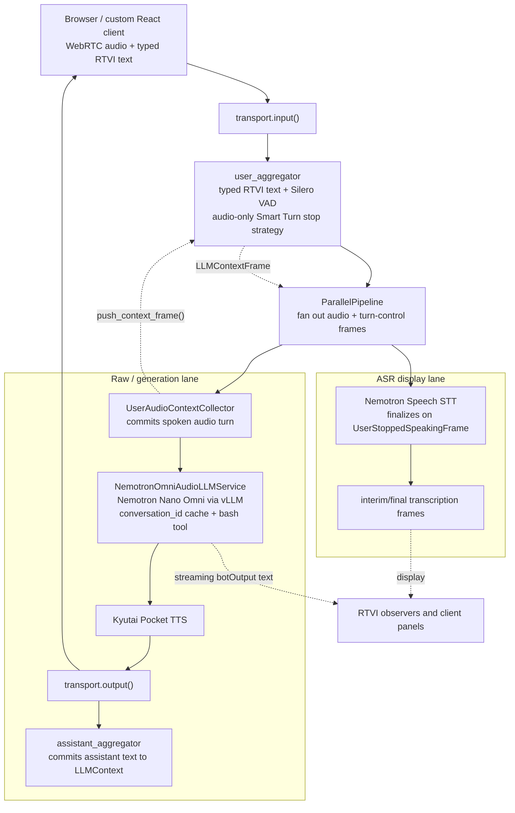

# Nemotron Nano Omni Local Voice Stack

This project implements a local voice agent, using the Nemotron Nano Omni multi-modal LLM running on an NVIDIA RTX 5090:

- vLLM serves `nvidia/Nemotron-3-Nano-Omni-30B-A3B-Reasoning-NVFP4`.
- Kyutai's Pocket TTS generates voice output (running on CPU).
- NVIDIA Nemotron Speech ASR generates streaming text transcripts for display in the UI.
- Pipecat orchestrates the streaming data flowing through the models, manages context, and handles tool calling.

This bot is very fast. Typically 125ms TTFT from Nemotron Nano Omni, and 40ms TTFB from Kyutai Pocket TTS. Complete voice-to-voice response time is about 500ms. This would be *too fast* without good end of turn detection.

The bot implements a bash tool for access to the local system. (Be careful with this!)

## Full Text And Audio Prefix Caching

We patch vLLM to implement full prefix caching for Nemotron Nano Omni.
This patch is separate from vLLM's standard hash-prefix cache, which is not fully implemented for the hybrid Nemotron architecture. We know exactly what kind of caching we want for our multi-turn conversation use case, so we can implement complete caching and a chat-completions protocol extension.

Chat completions requests can include a `conversation_id` field to enable prefix caching. For cached conversations, we save the full KV/Mamba state each time the model completes a conversation turn response.

### Chat Completions Protocol Extension

The vLLM patch extends `POST /v1/chat/completions` with two request fields:

- `conversation_id`: a non-empty string that identifies an append-only
  conversation cache entry. The cache key is `(model, cache_salt,
  conversation_id)`, so the same `conversation_id` can be isolated across models
  or `cache_salt` values.
- `conversation_require_cache`: a boolean. When `true`, the request `messages`
  are treated as a suffix-only append and vLLM must reject the request if the
  matching committed conversation prefix is not present.

The first turn sends the full conversation with `conversation_id`:

```json
{
  "model": "nemotron_3_nano_omni",
  "conversation_id": "pipecat-voice-session-123",
  "messages": [
    {"role": "system", "content": "..."},
    {"role": "user", "content": "..."}
  ],
  "stream": true
}
```

Later turns can send only the new user message:

```json
{
  "model": "nemotron_3_nano_omni",
  "conversation_id": "pipecat-voice-session-123",
  "conversation_require_cache": true,
  "messages": [
    {"role": "user", "content": "..."}
  ],
  "stream": true
}
```

Successful responses are normal OpenAI-compatible chat completion responses or
SSE streams. If `conversation_require_cache=true` and vLLM cannot satisfy the
request from the frontend conversation ledger, it returns HTTP `409` with an
OpenAI-style error whose `type` is `ConversationCacheMissError`; clients should
retry once with the full conversation and the same `conversation_id`.

Current implementation constraints: `conversation_id` supports `n=1`, does not
support beam search, does not support `continue_final_message`, and requires
`add_generation_prompt=true`. Concurrent generations for the same cache key are
rejected with HTTP `409`.

## Pipecat Pipeline Dataflow

We send user speech to Nemotron Nano Omni directly. The LLM responds with text,
which is sent to Kyutai Pocket TTS to generate output audio. The
separate ASR pipleine lane runs Nemotron Speech for streaming UI
transcription.

The Pipecat bot runs `user_aggregator` before the `ParallelPipeline` so typed
RTVI messages between the client and server, VAD, and audio-only Smart Turn end-of-turn detection are handled once before fan-out. The raw/generation lane owns audio collection, LLM inference, TTS, and assistant context aggregation. The ASR lane receives the same
post-aggregator audio/control frames and emits interim/final transcript frames
for display.

We use a custom audio-only Smart Turn user speaking stop strategy, because the standard Smart Turn strategy gates on both audio and transcription frames.`user_aggregator` is upstream of the parallel pipeline the fan-out, so the ASR service also
sees the completed `UserStoppedSpeakingFrame` and uses it to finalize/reset
utterances.

```python
pipeline = Pipeline(
    [
        transport.input(),
        user_aggregator,
        ParallelPipeline(
            [
                audio_collector,
                llm,
                tts,
                transport.output(),
                assistant_aggregator,
            ],
            [
                stt,
            ],
        ),
    ]
)
```



## Dependency Pins

- Pins are recorded in `checkouts.lock.json`.
- vLLM is checked out at `88d34c6` and patched from
  `patches/vllm-nemotron-omni-conversation-cache.patch`.
- Pipecat is checked out at `9697abe55` and is not patched.
- Pocket TTS and NeMo are unpatched pinned checkouts.

Do not commit changes inside `vllm-v0.20.0/`, `pipecat-core-code/`,
`pocket-tts/`, or `NeMo/`. Update `checkouts.lock.json` and top-level patches
instead.

## Prerequisites

- Linux host with an NVIDIA Blackwell GPU and recent driver.
- `uv`
- `git`
- Docker with NVIDIA runtime only if you still need the legacy ASR container.
- Hugging Face access for gated NVIDIA/Kyutai model assets.

## Clone The Workspace

Create the same checkout layout:

```bash
mkdir -p nemotron-nano-omni
cd nemotron-nano-omni

git clone https://github.com/vllm-project/vllm.git vllm-v0.20.0
git -C vllm-v0.20.0 checkout 88d34c6409e9fb3c7b8ca0c04756f061d2099eb1

git clone git@github.com:pipecat-ai/pipecat.git pipecat-core-code
git -C pipecat-core-code checkout 9697abe559d6f04e89e0888d5c32c1fcb140b60a

git clone https://github.com/kyutai-labs/pocket-tts.git pocket-tts
git -C pocket-tts checkout d5296066

git clone --filter=blob:none https://github.com/NVIDIA-NeMo/NeMo.git NeMo
git -C NeMo checkout 056d93754
```

Apply the vLLM patch:

```bash
git -C vllm-v0.20.0 am ../patches/vllm-nemotron-omni-conversation-cache.patch
```

## Download Models

```bash
uvx --from "huggingface_hub[cli]" huggingface-cli download \
  nvidia/Nemotron-3-Nano-Omni-30B-A3B-Reasoning-NVFP4 \
  --local-dir models/Nemotron-3-Nano-Omni-30B-A3B-Reasoning-NVFP4

uvx --from "huggingface_hub[cli]" huggingface-cli download \
  nvidia/nemotron-speech-streaming-en-0.6b \
  --local-dir models/nemotron-speech-streaming-en-0.6b
```

Pocket TTS downloads its CPU model assets on first use.

## Build Environments

vLLM:

```bash
uv venv --python 3.12 .venv-vllm-0.20.0-cu132
VIRTUAL_ENV=$PWD/.venv-vllm-0.20.0-cu132 \
PATH=$PWD/.venv-vllm-0.20.0-cu132/bin:$PATH \
VLLM_USE_PRECOMPILED=1 \
  uv pip install -e vllm-v0.20.0 --torch-backend=auto
```

Pipecat bot:

```bash
uv venv --python 3.12 .venv-pipecat
VIRTUAL_ENV=$PWD/.venv-pipecat PATH=$PWD/.venv-pipecat/bin:$PATH \
uv pip install \
  -e "pipecat-core-code[runner,webrtc,websocket,local-smart-turn,silero]" \
  aiohttp websockets requests
```

Pocket TTS:

```bash
uv venv --python 3.10 pocket-tts/.venv
VIRTUAL_ENV=$PWD/pocket-tts/.venv PATH=$PWD/pocket-tts/.venv/bin:$PATH \
uv pip install -e "pocket-tts[quantize]"
```

ASR server:

```bash
uv venv --python 3.12 .venv-asr
VIRTUAL_ENV=$PWD/.venv-asr PATH=$PWD/.venv-asr/bin:$PATH \
uv pip install --torch-backend=auto torch torchaudio
VIRTUAL_ENV=$PWD/.venv-asr PATH=$PWD/.venv-asr/bin:$PATH \
uv pip install aiohttp loguru numpy omegaconf
VIRTUAL_ENV=$PWD/.venv-asr PATH=$PWD/.venv-asr/bin:$PATH \
uv pip install -e "NeMo[asr]"
```

The ASR server follows NeMo's cache-aware streaming pattern: configure limited
right context, use the encoder cache between chunks, and run greedy decoding.
The local wrapper also disables decoder CUDA graph paths that have been fragile
on Blackwell.

## Run Services

Start ASR:

```bash
setsid -f scripts/start_asr_uv.sh > nemotron-asr.log 2>&1 < /dev/null
curl http://127.0.0.1:8080/health
```

Start Pocket TTS:

```bash
setsid -f pocket-tts/.venv/bin/pocket-tts serve \
  --host 127.0.0.1 --port 8001 --quantize \
  > pocket-tts-server.log 2>&1 < /dev/null
```

Start vLLM:

```bash
VLLM_CONVERSATION_CACHE_MAX_ENTRIES=8 \
VLLM_CONVERSATION_CACHE_MAX_TOKENS=16384 \
VLLM_CONVERSATION_CACHE_MIN_FREE_BLOCKS=64 \
VLLM_CONVERSATION_CACHE_TARGET_FREE_BLOCKS=128 \
setsid -f .venv-vllm-0.20.0-cu132/bin/python3 \
  .venv-vllm-0.20.0-cu132/bin/vllm serve \
  models/Nemotron-3-Nano-Omni-30B-A3B-Reasoning-NVFP4 \
  --served-model-name nemotron_3_nano_omni \
  --host 0.0.0.0 --port 8000 \
  --trust-remote-code \
  --gpu-memory-utilization 0.75 \
  --max-model-len 4096 \
  --max-num-seqs 1 \
  --max-num-batched-tokens 4096 \
  --limit-mm-per-prompt '{"audio": 128}' \
  --allowed-local-media-path / \
  --mm-encoder-attn-backend TORCH_SDPA \
  --skip-mm-profiling \
  --enforce-eager \
  --reasoning-parser nemotron_v3 \
  --enable-auto-tool-choice \
  --tool-call-parser qwen3_coder \
  --moe-backend cutlass \
  --enable-prefix-caching \
  --mamba-cache-mode align \
  --mamba-backend triton \
  > vllm-nemotron-omni-browser.log 2>&1 < /dev/null
```

The `VLLM_CONVERSATION_CACHE_*` values above are the normal 5090 browser-run
settings. They bound committed conversation IDs with LRU eviction and keep KV
free-block headroom. For an eviction stress test, temporarily set
`VLLM_CONVERSATION_CACHE_MAX_ENTRIES=2`; do not leave that value for normal
manual testing because it intentionally forces frequent cache misses and
full-context retries.

Start the browser bot:

```bash
NEMOTRON_OMNI_LOG=nemotron-omni-audio-bot-browser.log \
NEMOTRON_SPEECH_STT_URL=ws://127.0.0.1:8080 \
NEMOTRON_TTS_PROVIDER=pocket \
POCKET_TTS_URL=http://127.0.0.1:8001 \
PYTHONPATH=$PWD/src \
setsid -f .venv-pipecat/bin/python src/nemotron_voice/bot.py \
  -t webrtc --host 0.0.0.0 --port 7860 \
  > nemotron-omni-audio-bot-browser.stdout.log 2>&1 < /dev/null
```

Open `http://127.0.0.1:7860/client/`.

## Validate

Conversation cache integration:

```bash
.venv-vllm-0.20.0-cu132/bin/python3 scripts/test_vllm_conversation_prefix_cache.py \
  --reuse-server \
  --log vllm-nemotron-omni-browser.log \
  --results-json conversation-prefix-cache-metrics-results.json \
  --perf-repeats 1 \
  --long-turns 3
```

Bot smoke test with stub ASR:

```bash
PYTHONPATH=$PWD/src .venv-pipecat/bin/python scripts/smoke_step1_asr_bot.py \
  --asr-mode stub \
  --require-smart-turn \
  --require-local-tts \
  --tts-provider pocket \
  --max-tokens 48 \
  --client-run-secs 35 \
  --client-silence-secs 5 \
  --log-timeout-secs 90
```

Useful live checks:

```bash
curl -sS http://127.0.0.1:8000/metrics | rg 'conversation_cache_(queries|hits)'
curl -sS http://127.0.0.1:8080/health
nvidia-smi
```

## Stop Services

```bash
pkill -f 'vllm serve .*[N]emotron-3-Nano-Omni'
pkill -f '[n]emotron_voice/bot.py'
pkill -f '[p]ocket-tts serve'
pkill -f '[n]emotron_speech.server'
```

If the old Docker ASR path is still running:

```bash
docker stop nemotron-asr-step1
```
