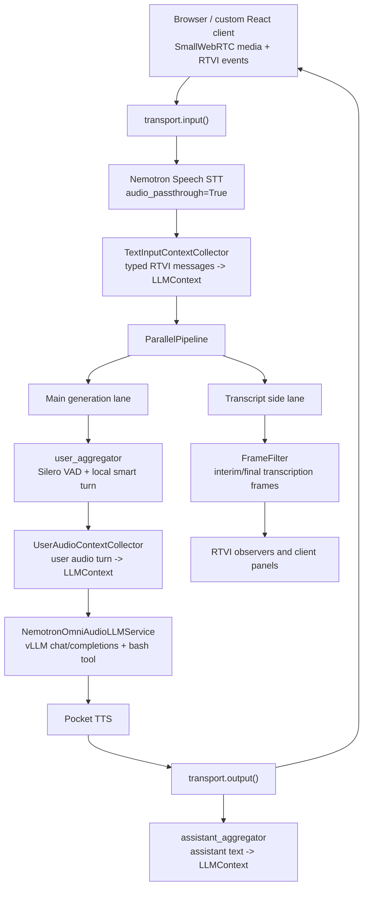

# Nemotron Nano Omni Local Voice Stack

This workspace runs a local browser voice agent on a single RTX 5090-class
machine:

- vLLM serves `nvidia/Nemotron-3-Nano-Omni-30B-A3B-Reasoning-NVFP4`.
- The Pipecat bot captures browser audio over SmallWebRTC.
- A local Nemotron Speech ASR server streams user transcripts.
- Pocket TTS runs as a CPU sidecar.

The top-level directory is a meta-workspace. The vLLM and Pipecat source trees
are nested, version-pinned dependency checkouts. Project-owned bot code and
Pipecat services live in `src/nemotron_voice`; the Pipecat checkout is read-only
reference/runtime code.

## Full Text And Audio Prefix Caching

This repo patches vLLM with a conversation prefix cache for Nemotron Nano Omni.
The patch is separate from vLLM's standard hash-prefix cache: it stores exact
committed conversation prefixes by `conversation_id`, including both text tokens
and audio-derived multimodal state.

The first request for a conversation sends the full context. After that, the
Pipecat LLM service sends only the latest user suffix and marks the request as
requiring the existing conversation cache entry. vLLM reconstructs the full
prompt from its committed frontend ledger, attaches the cached engine KV/Mamba
state, and computes only the new suffix. When the requested cache ID is missing,
vLLM returns a cache-miss response and the Pipecat service retries once with the
full context.

The cache is bounded by maximum entries, maximum prompt tokens, and KV free-block
headroom. When it needs space, vLLM evicts old committed conversation IDs and
keeps the requested ID when possible. Audio turns are cached with the same
conversation messages as text turns, so old audio does not need to be resent on
normal suffix-only turns.

### Chat Completions Protocol Extension

The vLLM patch extends `POST /v1/chat/completions` with two request fields:

- `conversation_id`: a non-empty string that identifies an append-only
  conversation cache entry. The cache key is `(model, cache_salt,
  conversation_id)`, so the same `conversation_id` can be isolated across models
  or `cache_salt` values.
- `conversation_require_cache`: a boolean. When `true`, the request `messages`
  are treated as a suffix-only append and vLLM must reject the request if the
  matching committed conversation prefix is not present.

The first turn sends the full conversation with `conversation_id`:

```json
{
  "model": "nemotron_3_nano_omni",
  "conversation_id": "pipecat-voice-session-123",
  "messages": [
    {"role": "system", "content": "..."},
    {"role": "user", "content": "..."}
  ],
  "stream": true
}
```

Later turns can send only the new user message:

```json
{
  "model": "nemotron_3_nano_omni",
  "conversation_id": "pipecat-voice-session-123",
  "conversation_require_cache": true,
  "messages": [
    {"role": "user", "content": "..."}
  ],
  "stream": true
}
```

Successful responses are normal OpenAI-compatible chat completion responses or
SSE streams. If `conversation_require_cache=true` and vLLM cannot satisfy the
request from the frontend conversation ledger, it returns HTTP `409` with an
OpenAI-style error whose `type` is `ConversationCacheMissError`; clients should
retry once with the full conversation and the same `conversation_id`.

Current implementation constraints: `conversation_id` supports `n=1`, does not
support beam search, does not support `continue_final_message`, and requires
`add_generation_prompt=true`. Concurrent generations for the same cache key are
rejected with HTTP `409`.

## Pipecat Pipeline Dataflow

Nemotron Nano Omni is the speech-aware LLM in the middle of the stack: it takes
the user's audio turn as model input and streams assistant text as model output.
The local ASR sidecar runs `nvidia/nemotron-speech-streaming-en-0.6b` to produce
streaming user transcripts for display and debugging; those transcripts are not
the primary input to the LLM. The TTS sidecar uses Kyutai Pocket TTS
(`kyutai/pocket-tts-without-voice-cloning`) to turn the LLM text back into bot
audio.

The Pipecat bot uses a `ParallelPipeline` so UI-facing text and generation can
move at the same time. One lane carries the turn-complete audio context into
Nemotron Nano Omni, streams LLM text onward to TTS, and records the assistant
message. The side lane filters transcription frames for RTVI observers and the
custom client, which lets the UI show live user/assistant text without making
ASR text drive the audio-language model path.



- The STT service emits transcription frames while passing audio through to the
  rest of the pipeline.
- The transcript side lane keeps interim and final transcript events visible in
  RTVI/client panels without feeding those transcript frames into TTS.
- The main lane waits for turn completion, stores the user audio turn in
  `LLMContext`, calls vLLM, speaks the assistant response, and records that
  assistant message back into `LLMContext`.
- The LLM service uses the vLLM conversation cache after the first committed
  turn and retries with full context if vLLM reports that the requested cache ID
  was evicted or never existed.

## Dependency Pins

- Pins are recorded in `checkouts.lock.json`.
- vLLM is checked out at `88d34c6` and patched from
  `patches/vllm-nemotron-omni-conversation-cache.patch`.
- Pipecat is checked out at `9697abe55` and is not patched.
- Pocket TTS and NeMo are unpatched pinned checkouts.

Do not commit changes inside `vllm-v0.20.0/`, `pipecat-core-code/`,
`pocket-tts/`, or `NeMo/`. Update `checkouts.lock.json` and top-level patches
instead.

## Prerequisites

- Linux host with an NVIDIA Blackwell GPU and recent driver.
- `uv`
- `git`
- Docker with NVIDIA runtime only if you still need the legacy ASR container.
- Hugging Face access for gated NVIDIA/Kyutai model assets.

## Clone The Workspace

Create the same checkout layout:

```bash
mkdir -p nemotron-nano-omni
cd nemotron-nano-omni

git clone https://github.com/vllm-project/vllm.git vllm-v0.20.0
git -C vllm-v0.20.0 checkout 88d34c6409e9fb3c7b8ca0c04756f061d2099eb1

git clone git@github.com:pipecat-ai/pipecat.git pipecat-core-code
git -C pipecat-core-code checkout 9697abe559d6f04e89e0888d5c32c1fcb140b60a

git clone https://github.com/kyutai-labs/pocket-tts.git pocket-tts
git -C pocket-tts checkout d5296066

git clone --filter=blob:none https://github.com/NVIDIA-NeMo/NeMo.git NeMo
git -C NeMo checkout 056d93754
```

Apply the vLLM patch:

```bash
git -C vllm-v0.20.0 am ../patches/vllm-nemotron-omni-conversation-cache.patch
```

## Download Models

```bash
uvx --from "huggingface_hub[cli]" huggingface-cli download \
  nvidia/Nemotron-3-Nano-Omni-30B-A3B-Reasoning-NVFP4 \
  --local-dir models/Nemotron-3-Nano-Omni-30B-A3B-Reasoning-NVFP4

uvx --from "huggingface_hub[cli]" huggingface-cli download \
  nvidia/nemotron-speech-streaming-en-0.6b \
  --local-dir models/nemotron-speech-streaming-en-0.6b
```

Pocket TTS downloads its CPU model assets on first use.

## Build Environments

vLLM:

```bash
uv venv --python 3.12 .venv-vllm-0.20.0-cu132
VIRTUAL_ENV=$PWD/.venv-vllm-0.20.0-cu132 \
PATH=$PWD/.venv-vllm-0.20.0-cu132/bin:$PATH \
VLLM_USE_PRECOMPILED=1 \
  uv pip install -e vllm-v0.20.0 --torch-backend=auto
```

Pipecat bot:

```bash
uv venv --python 3.12 .venv-pipecat
VIRTUAL_ENV=$PWD/.venv-pipecat PATH=$PWD/.venv-pipecat/bin:$PATH \
uv pip install \
  -e "pipecat-core-code[runner,webrtc,websocket,local-smart-turn,silero]" \
  aiohttp websockets requests
```

Pocket TTS:

```bash
uv venv --python 3.10 pocket-tts/.venv
VIRTUAL_ENV=$PWD/pocket-tts/.venv PATH=$PWD/pocket-tts/.venv/bin:$PATH \
uv pip install -e "pocket-tts[quantize]"
```

ASR server:

```bash
uv venv --python 3.12 .venv-asr
VIRTUAL_ENV=$PWD/.venv-asr PATH=$PWD/.venv-asr/bin:$PATH \
uv pip install --torch-backend=auto torch torchaudio
VIRTUAL_ENV=$PWD/.venv-asr PATH=$PWD/.venv-asr/bin:$PATH \
uv pip install aiohttp loguru numpy omegaconf
VIRTUAL_ENV=$PWD/.venv-asr PATH=$PWD/.venv-asr/bin:$PATH \
uv pip install -e "NeMo[asr]"
```

The ASR server follows NeMo's cache-aware streaming pattern: configure limited
right context, use the encoder cache between chunks, and run greedy decoding.
The local wrapper also disables decoder CUDA graph paths that have been fragile
on Blackwell.

## Run Services

Start ASR:

```bash
setsid -f scripts/start_asr_uv.sh > nemotron-asr.log 2>&1 < /dev/null
curl http://127.0.0.1:8080/health
```

Start Pocket TTS:

```bash
setsid -f pocket-tts/.venv/bin/pocket-tts serve \
  --host 127.0.0.1 --port 8001 --quantize \
  > pocket-tts-server.log 2>&1 < /dev/null
```

Start vLLM:

```bash
VLLM_CONVERSATION_CACHE_MAX_ENTRIES=8 \
VLLM_CONVERSATION_CACHE_MAX_TOKENS=16384 \
VLLM_CONVERSATION_CACHE_MIN_FREE_BLOCKS=64 \
VLLM_CONVERSATION_CACHE_TARGET_FREE_BLOCKS=128 \
setsid -f .venv-vllm-0.20.0-cu132/bin/python3 \
  .venv-vllm-0.20.0-cu132/bin/vllm serve \
  models/Nemotron-3-Nano-Omni-30B-A3B-Reasoning-NVFP4 \
  --served-model-name nemotron_3_nano_omni \
  --host 0.0.0.0 --port 8000 \
  --trust-remote-code \
  --gpu-memory-utilization 0.75 \
  --max-model-len 4096 \
  --max-num-seqs 1 \
  --max-num-batched-tokens 4096 \
  --limit-mm-per-prompt '{"audio": 128}' \
  --allowed-local-media-path / \
  --mm-encoder-attn-backend TORCH_SDPA \
  --skip-mm-profiling \
  --enforce-eager \
  --reasoning-parser nemotron_v3 \
  --enable-auto-tool-choice \
  --tool-call-parser qwen3_coder \
  --moe-backend cutlass \
  --enable-prefix-caching \
  --mamba-cache-mode align \
  --mamba-backend triton \
  > vllm-nemotron-omni-browser.log 2>&1 < /dev/null
```

The `VLLM_CONVERSATION_CACHE_*` values above are the normal 5090 browser-run
settings. They bound committed conversation IDs with LRU eviction and keep KV
free-block headroom. For an eviction stress test, temporarily set
`VLLM_CONVERSATION_CACHE_MAX_ENTRIES=2`; do not leave that value for normal
manual testing because it intentionally forces frequent cache misses and
full-context retries.

Start the browser bot:

```bash
NEMOTRON_OMNI_LOG=nemotron-omni-audio-bot-browser.log \
NEMOTRON_SPEECH_STT_URL=ws://127.0.0.1:8080 \
NEMOTRON_TTS_PROVIDER=pocket \
POCKET_TTS_URL=http://127.0.0.1:8001 \
PYTHONPATH=$PWD/src \
setsid -f .venv-pipecat/bin/python src/nemotron_voice/bot.py \
  -t webrtc --host 0.0.0.0 --port 7860 \
  > nemotron-omni-audio-bot-browser.stdout.log 2>&1 < /dev/null
```

Open `http://127.0.0.1:7860/client/`.

## Validate

Conversation cache integration:

```bash
.venv-vllm-0.20.0-cu132/bin/python3 scripts/test_vllm_conversation_prefix_cache.py \
  --reuse-server \
  --log vllm-nemotron-omni-browser.log \
  --results-json conversation-prefix-cache-metrics-results.json \
  --perf-repeats 1 \
  --long-turns 3
```

Bot smoke test with stub ASR:

```bash
PYTHONPATH=$PWD/src .venv-pipecat/bin/python scripts/smoke_step1_asr_bot.py \
  --asr-mode stub \
  --require-smart-turn \
  --require-local-tts \
  --tts-provider pocket \
  --max-tokens 48 \
  --client-run-secs 35 \
  --client-silence-secs 5 \
  --log-timeout-secs 90
```

Useful live checks:

```bash
curl -sS http://127.0.0.1:8000/metrics | rg 'conversation_cache_(queries|hits)'
curl -sS http://127.0.0.1:8080/health
nvidia-smi
```

## Stop Services

```bash
pkill -f 'vllm serve .*[N]emotron-3-Nano-Omni'
pkill -f '[n]emotron_voice/bot.py'
pkill -f '[p]ocket-tts serve'
pkill -f '[n]emotron_speech.server'
```

If the old Docker ASR path is still running:

```bash
docker stop nemotron-asr-step1
```
